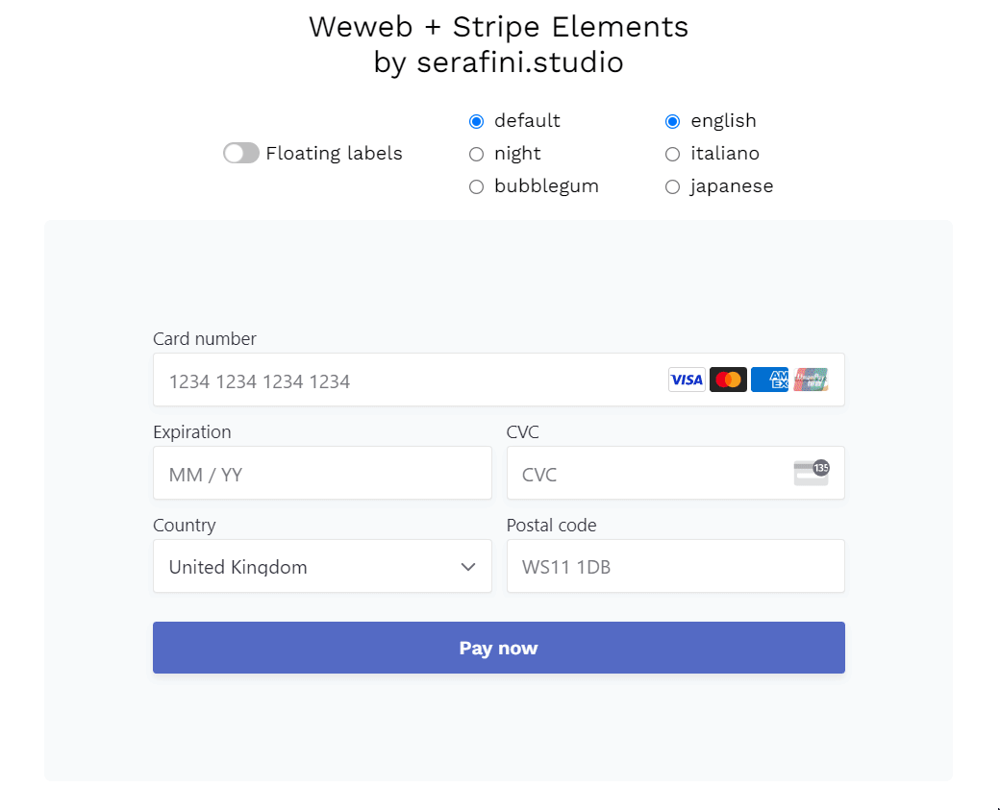

This is a test integration of Stripe Elements into weweb.io.

# Implemented features
- [x] Use Payment Element to collect payment details and confirm the payment
- [ ] Connected account
- [x] Automatic use test/live keys
- [x] Locale configuration
- [x] Appearance - Theme
- [x] Appearance - Variables
- [x] Appearance - Rules
- [x] Appearance - Labels floating/above
- [ ] Custom fonts
- [x] Api version override
- [x] Optionally disable advanced fraud detection

# Section component starter

This is a section for [weweb.io](https://www.weweb.io/).

## Installation

To run locally, first install all dependencies with `npm i`

## Start

To serve locally, run `npm run serve --port=[PORT]`, and then go to Weweb editor, open developper popup and add your custom section.

## Build

Before release, you can check build error by running `npm run build --name=my-section`
